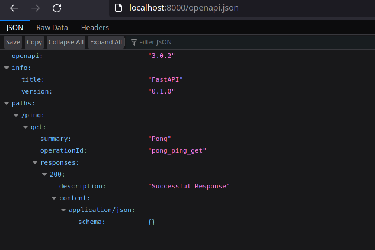

- [Introduction](#introduction)
- [Getting Started](#getting-started)
  - [Init](#init)
    - [Why Uvicorn?](#why-uvicorn)
  - [Running with auto-reload](#running-with-auto-reload)
  - [Configuration](#configuration)
    - [Dependency Injection](#dependency-injection)
  - [Playing around with environment variable](#playing-around-with-environment-variable)
    - [Using lru_cache](#using-lru_cache)
  - [Async Handlers](#async-handlers)
- [Docker Configuration](#docker-configuration)
  - [Dockerfile](#dockerfile)
  - [`docker-compose.yml`](#docker-composeyml)
- [Postgres Setup](#postgres-setup)
  - [`web-db` Dockerfile](#web-db-dockerfile)
  - [Re-configuring the `web` service](#re-configuring-the-web-service)
  - [Add configuration to FastAPI app](#add-configuration-to-fastapi-app)
  - [Build the new image & spin the containers](#build-the-new-image--spin-the-containers)
- [Toirtoise ORM](#toirtoise-orm)

# Introduction

An asynchronous text summarization API built with Test-Driven Development. The API follows RESTful design principles, using basic HTTP verbs: GET, POST, PUT and DELETE.

| Endpoint | HTTP Method | CRUD Method | Result |
| -------- | ----------- | ----------- | ------ |
| /summaries | GET | READ | get all summaries |
| /summaries/:id | GET | READ  | get a single summary |
| /summaries | POST | CREATE | add a summary |
| /summaries/:id | PUT | UPDATE | update a summary |
| /summaries/:id | DELETE | DELETE | delete a summary |

Along with **FastAPI**, we'll use **Docker** to quickly set up our local development environment and simplify deployment. A **PostgreSQL** database will be used, with **Tortoise ORM**, an async ORM, being used to interact with this it. `pytest` will be used instead of `unittest` for writing unit and integration test to test the API.

Finally, the code will be stored on a Github repository. We'll then use **GitHub Actions** to run tests, before deploying the app to Heroku.

`pytest`
# Getting Started

## Init

With in the **app/** directory, we need to add some files:
```
../project
├── app
│   ├── __init__.py
│   ├── main.py
```

Then, in **main.py**, an instance of FastAPI can be created. Doing the below sets up a route just for sanity check:
```py
from fastapi import FastAPI

app = FastAPI()


@app.get('/ping')
def pong():
    return {
        'ping': 'pong!'
    }
```

..then the server can be started by:
```sh
$ uvicorn app.main:app
```


What does this command mean? `app.main:app` tells Uvicorn where to find the FastAPI application: within the **app** module, in the **main.py** file, and the object created is named **app**.

FastAPI automatically generates a schema based on the [OpenAPI standard](https://swagger.io/docs/specification/about/). 

We can also view the raw JSON at http://localhost:8000/openapi.json. This can be used to automatically generate client-side code for a front-end or mobile application.



FastAPI uses this Open API json along with **Swagger UI** to create interactive API documentation, which can be viewed at http://localhost:8000/docs


### Why Uvicorn?

Unlike Django or Flask, FastAPI does not have a built-in development server. There are pros and cons to this.

On one hand, it takes a bit more to serve up the app in development mode. On the other hand, this helps to conceptually seperate the web framework from the web server. This is often a source of confusion for beginners when one moves from development to production with a web framework that does have a built-in development server (like Django).

Uvicorn is a ligtning-fast ASGI server implementation. We can read more about ASGI here:
[Introduction to ASGI: Emergence of an Async Python Web Ecosystem](https://florimond.dev/en/posts/2019/08/introduction-to-asgi-async-python-web/)

## Running with auto-reload

We should run Fast API with auto-reload so that the server would restart after changes to the code base. This should only be done during development.

```sh
$ uvicorn app.main:app --reload
```

## Configuration

A new file **config.py** is created in the **app** directory to define environment-specific configuration variables.

```python
# project/app/config.py
import logging
import os
from pydantic import BaseSettings


log = logging.getLogger('uvicorn')


class Settings(BaseSettings):
    environment: str = os.getenv('ENVIRONMENT', 'dev')
    testing: bool = os.getenv('TESTING', 0)


def get_settings() -> BaseSettings:
    log.info('Loading configuration...')
    return Settings()

```

Here we define `Settings` with two attributes:
- `environment`: defines the environment (dev/test/uat..)
- `testing`: defines whether or not we are in test mode

`Pydantic` is a useful library for data parsing and validation. It leverages Python type hints to coerce input types to declared type, accumulating all errors using `ValidationError`. `pydantic` enforces type hints at runtime and provides user-friendly errors when data is invalid. In our case, we are using it for settings management.

The `BaseSettings` class from Pydantic validates the data so that when we create an instance of `Settings`, `environment` and `testing` will have types of `str` and `bool` respectively.

Then, **main.py** needs to be updated to use this new configuration:
```py
# project/app/main.py
from fastapi import FastAPI, Depends
from app.config import get_settings, Settings

app = FastAPI()


@app.get('/ping')
def pong(settings: Settings=Depends(get_settings)):
    return {
        'ping': 'pong!',
        'environment': settings.environment,
        'testing': settings.testing
    }
```

### Dependency Injection

`settings: Settings=Depends(get_settings)`: The `Depend` function is a dependency that declares another dependency: `get_settings`. Put another way, `Depend` depends on the result of `get_settings`. The value returned by `get_settings`, `Settings` is then assigned to the `settings` parameter. This is FastAPI **dependency injection** system. We use it by importing `Depend` and give it a single parameter, a function.

When a new request arrives, FastAPI will take care of:
- Calling our dependency function,*that is passed to `Depend()`*, with the correct parameter.
- Get the result from the dependency function, then
- Assign the result to the parameter in our *path operation function*

## Playing around with environment variable

If we browse to http://localhost:8000/ping again, we'd see:
```json
{
  "ping": "pong!",
  "environment": "dev",
  "testing": false
}
```

We can kill the server and set the environment variable in shell:
```sh
$ export ENVIRONMENT=prod 
$ export TESTING=1
```

```json
{
  "ping": "pong!",
  "environment": "prod",
  "testing": true
}
```

If we try setting the `TESTING` variable to something that is not a boolean, such as:
```sh
$ export TESTING=hello
```

..and browse to the route, Fast API would throw an error:
```
...
  File "pydantic/main.py", line 406, in pydantic.main.BaseModel.__init__
pydantic.error_wrappers.ValidationError: 1 validation error for Settings
testing
  value could not be parsed to a boolean (type=type_error.bool)
```

Essentially, `get_settings` gets called for each individual request. For performance reason, it is best for `get_settings`, or any function that returns the configuration/setting values for that matter, to read from environment variables (instead of a file).

### Using lru_cache

```py
@functools.lru_cache(user_function, maxsize=128, typed=False)
```

`lru_cache` (Least recently used cache) can be used to call `get_settings` only once. This decorator wraps the function with a memoizing callable that serves up to the *maxsize* most recent calls.

```py
# project/app/config.py
import logging
import os
from pydantic import BaseSettings
from functools import lru_cache


log = logging.getLogger('uvicorn')


class Settings(BaseSettings):
    environment: str = os.getenv('ENVIRONMENT', 'dev')
    testing: bool = os.getenv('TESTING', 0)


@lru_cache()
def get_settings() -> BaseSettings:
    log.info('Loading configuration...')
    return Settings()
```

The difference can be inspected by looking at the server logs:

- **Without** `lru_cache()`:
```
INFO:     Loading configuration...
INFO:     127.0.0.1:49590 - "GET /ping HTTP/1.1" 200 OK
INFO:     Loading configuration...
INFO:     127.0.0.1:49590 - "GET /ping HTTP/1.1" 200 OK
INFO:     Loading configuration...
INFO:     127.0.0.1:49590 - "GET /ping HTTP/1.1" 200 OK
```
- **With** `lru_cache()`:
```
INFO:     Loading configuration...
INFO:     127.0.0.1:49614 - "GET /ping HTTP/1.1" 200 OK
INFO:     127.0.0.1:49614 - "GET /ping HTTP/1.1" 200 OK
INFO:     127.0.0.1:49614 - "GET /ping HTTP/1.1" 200 OK
INFO:     127.0.0.1:49614 - "GET /ping HTTP/1.1" 200 OK
```

## Async Handlers

Now, we can convert the synchronouse handler over to an asynchronous one. 

FastAPI makes it easy to deliver routes asynchronously. Rather than having to go through the trouble of spinning up a task queue (like Celery or RQ), or utilizing threads, as long as we don't have any blocking I/O calls in the handler, we can simply declare the handler as asynchronous by adding the `async` keyword:
```py
@app.get('/ping')
async def pong(settings: Settings=Depends(get_settings)):
    return {
        'ping': 'pong!',
        'environment': settings.environment,
        'testing': settings.testing
    }
```

# Docker Configuration

## Dockerfile

```Dockerfile
FROM python:3.9.6-slim-buster

WORKDIR /usr/src/app

ENV PYTHONDONTWRITEBYTECODE 1
ENV PYTHONBUFFERRED 1

RUN apt-get update\
 && apt-get -y install netcat gcc \
 && apt-get clean

RUN pip install --upgrade pip
COPY ./requirements.txt .
RUN pip install -r requirements.txt

COPY . .
```

We start with a slim-buster-based Docker image for Python 3.9.6. Then, we set a working directory, as well as two environment variables:
- `PYTHONDONTWRITEBYTECODE`: Prevents Python from writing `pyc` files to disc (equivalent to `python -B`).
- `PYTHONBUFFERRED`: Prevents Python from buffering stdout and stderr (equivalent to `python -u`)

We also need a `.dockerignore` to exclude specific files and folders from being copied over to the image.
```
.dockerignore
Dockerfile
Dockerfile.prod
```

At this stage, I tried running `docker build .` and everything completed successfuly.

## `docker-compose.yml`

```yml
version: '3.8'

services:
  web:
    build: ./project/
    command: uvicorn app.main:app --reload --workers 1 --host 0.0.0.0 --port 8000
    volumes:
      - ./project:/usr/src/app
    ports:
      - 8004:8000
    environment:  
      - ENVIRONMENT=dev
      - TESTING=0
```

This configuration will create a service called `web` from the Dockerfile.

When the container spins up, Uvicorn will run with the following settings:
- `reload` enables auto reload.
- `workers 1` provides single worker process.
- `host 0.0.0.0` defines the address to host the server on.
- `port 8000` defines the port to host the server on.

The `volume` is used to mount the base directory `project/` into the container, within the working directory `/usr/src/app`. **This is a must** for development environment, in order to update the container whenever a change to the source code is made. Without this option, we'd need to rebuild the image each time we make changes to the codebase. That'would be inconvenient.

The docker compose file version we used is `3.8`. This has no relation with the version of docker compose installed. It simply specifies the file format that we want to use.

We can build the image now:
```sh
$ docker-compose build
```

Then, we can fire up the container in **detached mode**:
```sh
$ docker-compose up -d
```

At this point, we should be able to browse to http://localhost:8004/ping:


# Postgres Setup

What we need to do now is to configure Postgres, get it up and running in another container, then link it to the `web` service.

Then, we'll set up Tortoise ORM and configure a model.

First, we need to configure Postgres by adding a new service to `docker-compose.yml` with the appropriate environment variables and install `asyncpg`.

```
$ mkdir project/db
$ touch create.sql
```

```sql
CREATE DATABASE web_dev;
CREATE DATABASE web_test;
```

## `web-db` Dockerfile

Within this `db/` directory, we'd also add a Dockerfile.
```dockerfile
FROM postgres:13-alpine

# run create.sql on init
ADD create.sql /docker-entrypoint-initdb.d
```

Here, we pull an Alpine-based Postgres image. We then extend this image by adding `create.sql` to `docker-entrypoint-initdb.d` directory in the container. By doing this, **the file will execute on init**.

Quote from https://hub.docker.com/_/postgres:
> ## Initialization scripts
> 
> If you would like to do additional initialization in an image derived from this one, add one or more *.sql, *.sql.gz, or *.sh scripts under /docker-entrypoint-initdb.d (creating the directory if necessary). After the entrypoint calls initdb to create the default postgres user and database, it will run any *.sql files, run any executable *.sh scripts, and source any non-executable *.sh scripts found in that directory to do further initialization before starting the service.
> 
> Warning: scripts in /docker-entrypoint-initdb.d are only run if you start the container with a data directory that is empty; any pre-existing database will be left untouched on container startup. One common problem is that if one of your /docker-entrypoint-initdb.d scripts fails (which will cause the entrypoint script to exit) and your orchestrator restarts the container with the already initialized data directory, it will not continue on with your scripts.

After setting up our Postgres image, we'll add a new service `web-db` to `docker-compose.yml`:
```yml
version: '3.8'

services:
  web:
    build: ./project/
    command: uvicorn app.main:app --reload --workers 1 --host 0.0.0.0 --port 8000
    volumes:
      - ./project:/usr/src/app
    ports:
      - 8004:8000
    environment:  
      - ENVIRONMENT=dev
      - TESTING=0
    depends_on:
      - web-db

  web-db:
    build:
      context: ./project/db/
      dockerfile: Dockerfile
    expose:
      - 5432
    environment:
      - POSTGRES_USER=postgres
      - POSTGRES_PASSWORD=postgres
```

The `depends_on` config expresses dependency between services. This configuration leads to the following behaviours:

- `docker-compose up` will start the services in dependency order. In our case, `web-db` are started before `web`.
- `docker-compose up SERVICE` automatically includes `SERVICE`'s dependencies. In our case, if we do `docker-compose up web`, `web-db` is also created and started.
- `docker-compose stop` stops services in dependency order. In our case, `web` is stopped before `web-db`.

Once spun up, Postgres will be available on port `5432` for services running in other containers. 

## Re-configuring the `web` service

The `web` service is dependent not only on the container being up and running, but also the actual Postgres instance being up and healthy. Therefore, let's add `entrypoint.sh` file to the `project/` directory:
```sh
#!/bin/sh

echo "Waiting for Postgres..."

while ! nc -z web-db 5432; do
    sleep 0.1
done

echo "PostgreSQL started."

exec "$@"
```

What we are doing here is using `netcat` to scan the service using its name `web-db`, until `Connection to web-db port 5432 [tcp/postgresql] succeeded!` is returned.

`exec "$@"` run the command given by the command line parameters in such a way that the current process is replaced by it. Without this, the parent shell process survives and waits for the child to exit. With this, the child process **replaces** the parent process entirely when there's nothing for the parent to do after forking the child. It is a form of **optimization**. The ELI5 definition is: "Do everything in this `.sh` script, then in the same shell run the command the user passes in on the command line."

Then, we update `project/Dockerfile` to install the appropriate dependency packages and supply an entrypoint.

```dockerfile
FROM python:3.9.6-slim-buster

WORKDIR /usr/src/app

ENV PYTHONDONTWRITEBYTECODE 1
ENV PYTHONBUFFERRED 1

RUN apt-get update\
 && apt-get -y install netcat gcc postgresql\
 && apt-get clean

RUN pip install --upgrade pip
COPY ./requirements.txt .
RUN pip install -r requirements.txt

COPY . .

COPY ./entrypoint.sh .
RUN chmod +x /usr/src/app/entrypoint.sh

ENTRYPOINT ["/usr/src/app/entrypoint.sh"]
```

We also need to add `asyncpg` to our project requirements:
```sh
$ poetry add asyncpg
```

## Add configuration to FastAPI app

Next, we need to update `config.py` to read `DATABASE_URL` and assign the value to `database_url`. 
```py
import logging
import os
from pydantic import BaseSettings, AnyUrl
from functools import lru_cache


log = logging.getLogger('uvicorn')


class Settings(BaseSettings):
    environment: str = os.getenv('ENVIRONMENT', 'dev')
    testing: bool = os.getenv('TESTING', 0)
    database_url: AnyUrl = os.environ.get('DATABASE_URL')


@lru_cache()
def get_settings() -> BaseSettings:
    log.info('Loading configuration...')
    return Settings()
```

`AnyUrl` from `pydantic` is used for URL validation.

## Build the new image & spin the containers

After we have done this, we can build the new image and spin up the two container. We also need to add execution to the `entrypoint.sh`'s permission.  
```sh
$ chmod +x project/entrypont.sh
$ docker-compose up -d --build
```

We can also inspect the **logs** for `web` service:
```sh
$ docker-compose logs web
```
```
web_1     | Waiting for Postgres...
web_1     | PostgreSQL started.
web_1     | INFO:     Will watch for changes in these directories: ['/usr/src/app']
web_1     | INFO:     Uvicorn running on http://0.0.0.0:8000 (Press CTRL+C to quit)
web_1     | INFO:     Started reloader process [1] using statreload
web_1     | INFO:     Started server process [9]
web_1     | INFO:     Waiting for application startup.
web_1     | INFO:     Application startup complete.
web_1     | INFO:     Shutting down
web_1     | INFO:     Waiting for application shutdown.
web_1     | INFO:     Application shutdown complete.
web_1     | INFO:     Finished server process [9]
web_1     | INFO:     Stopping reloader process [1]
web_1     | Waiting for Postgres...
web_1     | PostgreSQL started.
web_1     | INFO:     Will watch for changes in these directories: ['/usr/src/app']
web_1     | INFO:     Uvicorn running on http://0.0.0.0:8000 (Press CTRL+C to quit)
web_1     | INFO:     Started reloader process [1] using statreload
web_1     | INFO:     Started server process [10]
web_1     | INFO:     Waiting for application startup.
web_1     | INFO:     Application startup complete.
web_1     | INFO:     Loading configuration...
web_1     | INFO:     172.18.0.1:38288 - "GET /ping HTTP/1.1" 200 OK
web_1     | INFO:     172.18.0.1:38304 - "GET /ping HTTP/1.1" 200 OK
```

If we want to access the database via psql, we could also use `docker-compose` for this:
```sh
$ docker-compose exec web-db psql -U postgres
```

# Toirtoise ORM

